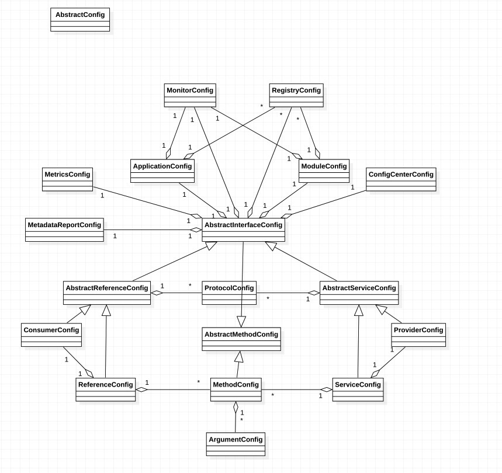

# dubbo配置

## dubbo配置UML 

### 1. ApplicationConfig

```xml
    <dubbo:application name="demo-application" version="1.0.0" owner="xun" organization="qudian" architecture="" environment="dev" compiler="javassist" logger="slf4j" monitor="" registry=""/>
```

##### 配置项解释 

| 名称    |类型| 解释 |
| :------ |-------| ---------|
| name   |String| 应用的名称，随便取名 |
| version| String | 应用的版本       |
| owner | String | 应用负责人 |
| organization | String | 组织名称 估计就是个名称 |
| architecture | String | __不懂__ |
| environment | String | 环境，比如：dev，test，product |
| compiler | String | jdk或javassist。生成动态代理的时候用的 |
| logger | String | 使用哪种日志框架，比如：slf4j,jcl,log4j,log4j2,jdk |
| monitor | String | ref   see monitorConfig，可以不填 |
| registry | String | ref    see registryConfig，可以不填 |


### 2. MonitorConfig

```xml
<dubbo:monitor protocol="" address="" Interval="" username="" password="" group="" version="" default=""/>
```

#####  配置项解释

| 名称     | 类型   | 解释                                   |
| -------- | ------ | -------------------------------------- |
| protocol | String | RPC协议类型，dubbo，registry           |
| address  | String | 监控中心地址，比如 10.20.130.230:12080 |

### 3. RegistryConfig

```xml
<dubbo:registry id="registry1" address="" protocol="" port="" version="" password="" username="" transport="" timeout="" session="" file="" wait="" check="" register="" subscribe="" dynamic="" group="" simplified="" extra-keys="" cluster="" client="" forks="" server="" transporter="" />
```

##### 配置项解释

| 名称        | 类型    | 解释                                                         |
| ----------- | ------- | ------------------------------------------------------------ |
| id          | String  | 注册中心的ID，因为一个应用可以有多个注册中心（多个集群），   |
| address     | String  | 比如 zookeeper://127.0.0.1:2181，这个地址带协议和端口        |
| protocol    | String  | 比如dubbo(这个是直连吗？)   multicast，zookeeper，redis      |
| port        | Int     | address配置了，port就不用配置                                |
| username    | String  | 登录注册中心的用户名，有的注册中心需要                       |
| password    | String  | 登录注册中心的密码                                           |
| transport   | String  | 网络传输方式，可选mina, netty   __（是dubbo框架底层使用的那个协议吗）__ |
| timeout     | Int     | 请求注册中心的超时时间                                       |
| session     | Int     | 注册中心会话的超时时间                                       |
| file        | String  | 本地保存注册中心数据的文件名，默认在~/.dubbo目录下           |
| wait        | Int     | 停止之前等待的时间                                           |
| check       | Boolean | 是否检查注册中心是否存在，默认true                           |
| register    | Boolean | 是否向该注册中心注册，默认true。如果是false，只订阅不注册    |
| subscribe   | Boolean | 是否订阅从该注册中心订阅服务，默认true。                     |
| dynamic     | Boolean | 默认true，服务启动时自动注册，服务停止时自动取消注册。       |
| group       | String  | dubbo分组                                                    |
| simplified  | Boolean | ？？？since 2.7.0                                            |
| extra-keys  | String  | ？？？与simplified一起的                                     |
| cluster     | String  | ？？？                                                       |
| forks       | String  | ？？？                                                       |
| server      | String  | ？？？                                                       |
| transporter | String  | ？？？                                                       |


### 4. ModuleConfig

```xml
<dubbo:module id="" name="" organization="" owner="" version="" registry="" monitor="" />
```

##### 配置项解释

| 名称         | 类型   | 解释                      |
| ------------ | ------ | ------------------------- |
| id           | String | module1                   |
| name         | String |                           |
| organization | String |                           |
| owner        | String |                           |
| version      | String | 1.0.0                     |
| registry     | String | 有多个 see RegistryConfig |
| monitor      | String | see MonitorConfig         |


### 5. ConfigCenterConfig

```xml
<dubbo:config-center protocol="" address="" highest-priority="" namespace="" cluster=""  group=""  check=""  config-file="" timeout="" username="" password=""  include-spring-env="" app-config-file="" />
```

##### 配置项解释

| 名称               | 类型    | 解释                                                         |
| ------------------ | ------- | ------------------------------------------------------------ |
| protocol           | String  | 注册中心的协议，比如：apollo、zookeeper、nacos               |
| address            | String  | 比如zookeeper://127.0.0.1:2222。address中有协议头，protocol可以不写 |
| highest-priority   | Boolean | 来自注册中心的配置是否有最高优先级                           |
| namespace          | String  | 命名空间？？用于隔离                                         |
| cluster            | String  | ？？？                                                       |
| group              | String  | ？？？                                                       |
| check              | Boolean | 是否检查配置中心是否活着                                     |
| config-file        | String  | 在配置中心中，配置文件的名称                                 |
| timeout            | Int     | 获取配置中心配置的超时时间                                   |
| username           | String  | 登录配置中心的用户名                                         |
| password           | String  | 登录配置中心的密码                                           |
| include-spring-env | Boolean | 是否从Spring Environment中读取配置。？？？                   |
| app-config-file    | String  | 在配置中心中，这个应用的配置文件的名称                       |


### 6. MetricsConfig

 (加监控用的，目前还不了解)

```xml
<dubbo:metrics port="" protocol="" />
```

##### 配置项解释

| 名称               | 类型    | 解释                                                         |
| ------------------ | ------- | ------------------------------------------------------------ |
| port               | Int     |                                                            |
| protocol           | String  |                                                            |


### 7. MetadataReportConfig

```xml
    <dubbo:metadata-report id="" address="" timeout="" cluster="" group="" username="" password="" cycle-report="" retry-period="" retry-times="" sync-report="" />
```

##### 配置项解释

| 名称         | 类型    | 解释                       |
| ------------ | ------- | -------------------------- |
| id           | String  |                            |
| address      | String  | zookeeper://127.0.0.1:2181 |
| timeout      | Int     | 超时时间                   |
| cluster      | String  | ？？？                     |
| group        | String  | 分组                       |
| username     | String  |                            |
| password     | String  |                            |
| cycle-report | Boolean | 是否周期性保存             |
| retry-period | Int     | 重试间隔                   |
| retry-times  | Int     | 重试次数                   |
| sync-report  | Boolean | 是否异步保存，默认true     |


### 8. AbstractMethodConfig

##### 配置项解释

| 名称        | 类型           | 解释                                                         |
| ----------- | -------------- | ------------------------------------------------------------ |
| timeout     | Int            | 调用的超时时间                                               |
| retries     | Int            | 调用异常的重试次数，默认3次                                  |
| actives     | Int            | 最大同时调用的次数，默认                                     |
| loadbalance | String         | 负载均衡算法，比如：consistenthash，leastactive，random，roundrobin。默认random |
| async       | Boolean        | 是否异步，默认false                                          |
| sent        | Boolean        | ？？？                                                       |
| mock        | String         | mockClass的BeanName，当服务掉不通的时候，会调用mockClass     |
| merger      | String         | ？？？                                                       |
| cache       | String/Boolean | lru，threadlocal，jcache。默认false。最好还是不要cache       |
| validation  | Boolean        | 校验参数 默认false                                           |
| forks       | Int            | 跟cluster的参数有关？？？                                    |


### 9. AbstractInterfaceConfig

##### 配置项解释

| 名称                 | 类型                  | 解释                                                     |
| -------------------- | --------------------- | -------------------------------------------------------- |
| stub                 | String/Boolean        | 本地代理类？？？？用于在客户端执行本地逻辑               |
| monitor              | MonitorConfig         | ref                                                      |
| proxy                | String                | jdk， javassist （和application.complier有啥关系）       |
| cluster              | String                | cluster类型，failover/failfast/failsafe/failback/forking |
| filter               | String                | 自定义过滤器，多个用逗号隔开                             |
| listener             | String                | 自定义listener，多个用逗号隔开                           |
| owner                | String                | xun                                                      |
| connections          | Int                   | 最大连接数，dubbo是长连接                                |
| layer                | String                | The layer of service providers ？？？                    |
| application          | ApplicationConfig     | ref                                                      |
| module               | ModuleConfig          | ref                                                      |
| registries           | List\<RegistryConfig> | ref                                                      |
| registryIds          | String                | ???                                                      |
| onconnect            | String                | ???                                                      |
| ondisconnect         | String                | ???                                                      |
| metrics              | MetricsConfig         | ref                                                      |
| metadataReportConfig | MetadataReportConfig  | ref                                                      |
| configCenter         | ConfigCenterConfig    | ref                                                      |
| callbacks            | Int                   | 回调次数？？                                             |
| scope                | String                | the scope for referring/exporting a service              |
| tag                  | String                | ？？？                                                   |


### 10. ProtocolConfig

```xml
<dubbo:protocol name="dubbo" id="" default="" transporter="" server="" register="" port="" client="" accepts="" accesslog="" buffer="" charset="" codec="" contextpath="" corethreads="" dispatcher="" dispather="" exchanger="" extension="" heartbeat=" " host="" iothreads="" keepalive="" networker="" optimizer="" path="" payload="" prompt="" queues="" serialization="" status="" telnet="" threadpool="" threads=""/>
```

##### 配置项解释

未完，待续。。。
| 名称 | 类型   | 解释      |
| ---- | ------ | --------- |
| id   | String | 默认dubbo |
| name | String | 默认dubbo |
|      |        |           |
|      |        |           |
|      |        |           |
|      |        |           |
|      |        |           |
|      |        |           |


